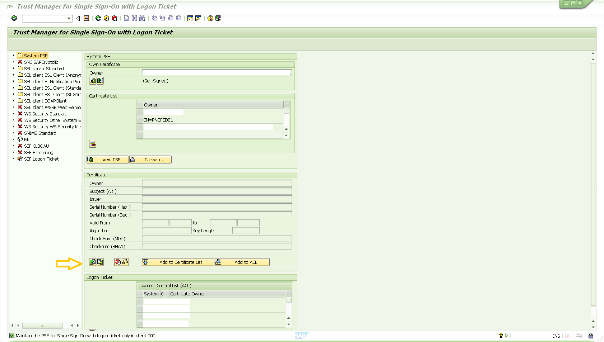
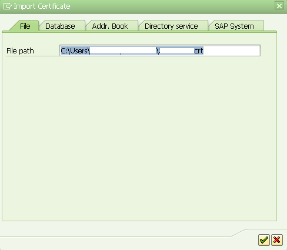
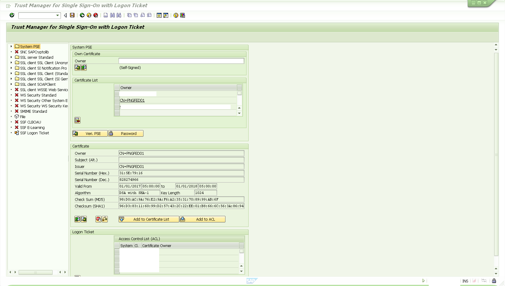
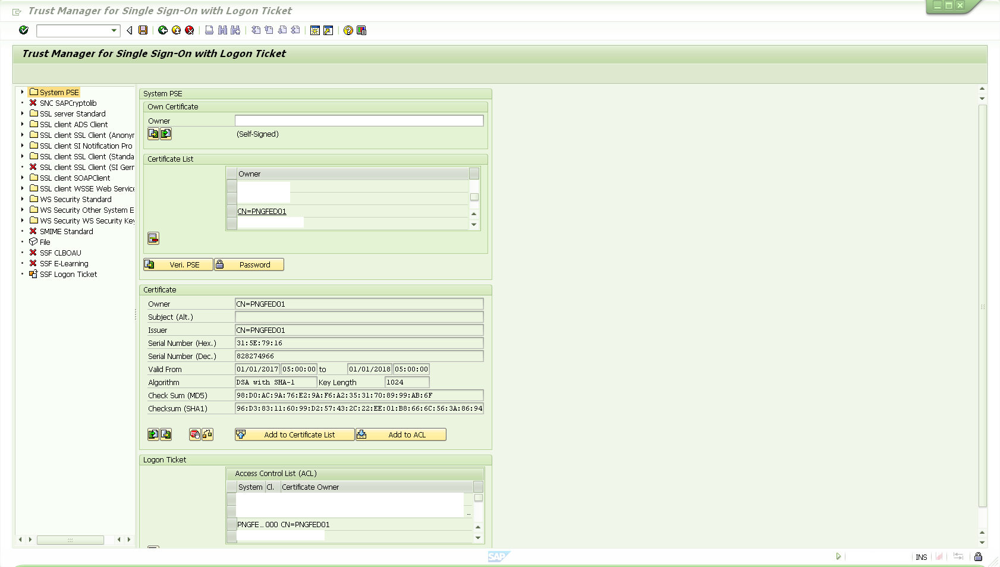
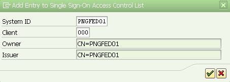

<h1 align="center">
    mysapsso2-sp-token-adapter
</h1>

 
    This code provides Ping Federate SAP SSO Integration to Java and ABAP backend stacks without the need for the Netweaver Gateway to create MYSAPSSO2 cookies. Embedded in this repository is the <code>TicketCreator.java</code> class, which is a stand-alone java class which generates the MYSAPSSO2 cookie, and thus could be used multiple integration types.

 

## Summary
This solution provides SAP SSO for web applications such as the SAP Portal, and SAP Fiori applications, as well as thick client SAP application such as the SAP GUI.  The solution is HTTPS throughout, so credentials are always encrypted.  MFA of course could be added via the Ping Federate authentication policy setup.

The SAP GUI portion of the solution generates a "SAPShortcut" file.  The user clicks on this file which launches the SAP GUI.  Once the user selects which system then want to log into, SSO logs them in. 

The SAP web portion of the solution accepts a redirect url, and simply generates a MYSAPSSO2 cookie before forwarding the request to the redirected application.  The benefit of this solution is that it works exactly the same way as the SAP solution, but does not require the SAP Netweaver Portal as an intermediary system. 

## Prerequisites

The public key for the signing certificate must be obtained from a Ping administrator.  SAP backend systems only support SHA1withDSA digital certificates, which is not considered secure in 2021.  However, this IS still the only option available with SAP systems for SSO!  As a result of this standard being out of date, Ping Federate doesn't support generating a SHA1/DSA keypair directly in the web admin console, however Ping Federate administrators can create a SHA1/DSA key and add it to the Ping Federate Java Key Store (JKS) manually at the command line.  Once this key is in the Ping Federate JKS file, the Ping Federate UI will display and allow you to use this legacy key.

Therefore step one would be to make sure that thre is a SHA1withDSA keypair created in the Ping Federate system you want the SAP systems to trust (for example you can use openssl for this purpose) and have this certificate ready for importing in the the trusting SAP systems via the process outlined below.

A user in the target SAP system/SID needs to log into the GUI and start transaction STRUSTSSO2. 

Click on the "Import Certificate" button located in the middle of the screen. 

With the certificate imported, click on the button "Add to certificate List".  This will add a "CN=PNGFED01" entry to the window above. 

Click on the "Add to ACL" button and add the parameters exactly as shown in the screenshots below: 

Click on the "Save" icon at the top of the screen. 

NOTE:  You can continue to use SNC for encrypting the SAP GUI traffic with either the SAP provided SNC libraries or a third party provided SNC library.  SNC is completely independent from the SSO login capability to the SAP GUI.

# User Experience for SAP GUI

Open browser and navigate to https://pingfedhost.yourcompany.com/sp/startSSO.ping?SpSessionAuthnAdapterId=SAPGUI or deploy this a web browser shortcut to the users desktop.  Double clicking this shortcut will launch the users default web browser 

The next page displays and auto downloads a SAPGUI.sap "SAP shortcut" file.  Double clicking (opening) the file takes you to the real SAP GUI on the local PC.  Follow the instructions on the screen to launch the client. 

# User experience for SAP web applications (Fiori or other SAP proprietary web application technologies like ITS)
Simply use the following URL and provide the appropriate TargetResource. 

https://pingfedhost.yourcompany.com/sp/startSSO.ping?SpSessionAuthnAdapterId=SAPGUI&TargetResource=<TargetWebURL> 

Example:  To generate a MYSAPSSO2 cookie for the web application located at http://yourapp.com, simply use this URL.  https://pingfedhost.yourcompany.com/sp/startSSO.ping?SpSessionAuthnAdapterId=SAPGUI&TargetResource=http://yourapp.com 
